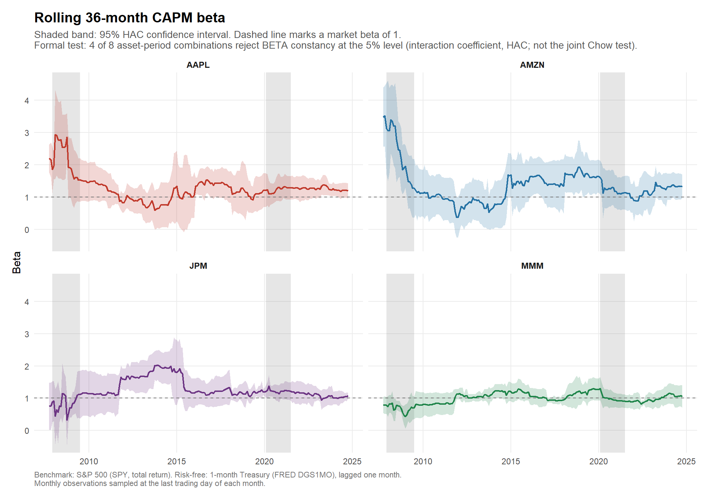

# Financial Market Analysis — CAPM Estimation Across Two Crises

[](https://github.com/DanieleBrignani/financial-market-analysis/actions/workflows/ci.yml)


Time-series CAPM estimation for four US large caps over twenty years of monthly
data (September 2004 – September 2024), with separate estimation windows for the
Global Financial Crisis and the COVID-19 shock.

The question is narrow and testable: **do these stocks earn a return the market
factor cannot explain, and is their systematic risk stable across regimes?**

---

## Headline findings

**1. Do these stocks earn returns the market factor cannot explain?**
On the full sample, Apple and Amazon show large, statistically significant
alphas (24.2%/yr, t = 3.32, p < 0.01; and 17.0%/yr, t = 2.19, p < 0.05,
respectively). 3M and JPMorgan — the sector-representative controls — show
alphas indistinguishable from zero (t = -0.48 and 0.41). As flagged above,
Apple and Amazon were selected in 2026 knowing they had survived and performed
well since 2004: the large alphas are consistent with survivorship selection,
not demonstrated evidence of exploitable mispricing.

**2. Is systematic risk stable across regimes?**
`output/tables/beta_stability.csv` finds 4 of 8 asset-period combinations
reject beta constancy at 5% (shift test); the joint Chow-type test rejects in
5 of 8. Amazon and 3M show the largest beta shifts in crisis windows (roughly
-0.23 to -0.39), while JPMorgan's beta is essentially unchanged in both crises.

**3. How much can a 19-month crisis window actually tell you?**
Standard errors on beta roughly double to triple inside the crisis windows
relative to the full sample (e.g. Apple's beta SE rises from ~0.07 full-sample
to ~0.10 in the GFC window), which is why sub-period point estimates are
reported alongside their confidence intervals rather than read in isolation.



> If the image above does not render, the pipeline has not been run in this
> checkout yet. Run `make run`, then commit `output/figures/*.png` and
> `data/processed/monthly_prices.csv`.

---

## What the pipeline produces

| Figure | Content |
|---|---|
| `01_cumulative_growth.png` | Growth of \$1, log scale, crisis windows shaded |
| `02_excess_returns.png` | Monthly excess returns by asset |
| `03_characteristic_lines.png` | Excess return scatter with fitted CAPM line |
| `04_rolling_beta.png` | 36-month rolling beta |
| `05_correlation_matrix.png` | Correlation of excess returns |
| `06_alpha_confidence.png` | Alpha with 95% HAC confidence intervals |
| `07_beta_shift.png` | Estimated change in beta per crisis window, with HAC intervals |

| Table | Content |
|---|---|
| `capm_estimates.csv` | Full estimates: alpha, beta, OLS **and** HAC standard errors, t-statistics, p-values, R², Durbin–Watson, Breusch–Pagan, Jarque–Bera |
| `capm_summary.csv` | Publication-style summary table |
| `descriptive_*_returns.csv` | Moments, annualised return and volatility, Sharpe ratio, maximum drawdown |
| `rolling_betas.csv` | Rolling alpha/beta paths with HAC standard errors and bands |
| `beta_stability.csv` | Beta shift per crisis window, HAC $t$-test, and joint Chow-type Wald test |
| `session_info.txt` | Full provenance: R version, package versions, run timestamp |

---

## Quick start

```bash
git clone https://github.com/DanieleBrignani/financial-market-analysis.git
cd financial-market-analysis

Rscript scripts/setup.R          # install dependencies (once)
Rscript tests/testthat.R         # verify the estimator
Rscript scripts/run_analysis.R   # run the full pipeline
```

Or with `make`: `make setup && make test && make run`.

**Offline runs.** After one live run, `data/processed/monthly_prices.csv` is
written and `make offline` will reproduce the entire analysis from it with no
network access. Commit that file: it pins the sample against Yahoo's periodic
restatement of adjusted closes, and it is what makes CI deterministic. Until it
is committed, CI falls back to a live run and emits a warning.

### In VS Code

Install the [R extension](https://marketplace.visualstudio.com/items?itemName=REditorSupport.r),
open the folder, and use **Ctrl+Shift+B** (run analysis) or **Ctrl+Shift+P →
Tasks: Run Test Task**. Debug configurations for both entry points are in
`.vscode/launch.json`. On Windows, adjust `r.rterm.windows` in
`.vscode/settings.json` to your R installation path.

---

## Method

The estimated relation is the Sharpe–Lintner time-series regression

$$r_{i,t} - r_{f,t} = \alpha_i + \beta_i\,(r_{m,t} - r_{f,t}) + \varepsilon_{i,t}$$

with the null of interest $\alpha_i = 0$.

**Data.** Daily adjusted closes from Yahoo Finance, sampled on the last trading
day of each calendar month. Series are merged on the date index rather than
assumed to share a trading calendar, then reduced to complete cases.

**Benchmark.** SPY, whose adjusted close reinvests distributions and therefore
measures the S&P 500 on a **total-return** basis, matching the dividend-adjusted
asset legs. Yahoo's `^GSPC` is the price index and must not be used here.

**Risk-free rate.** The FRED one-month Treasury constant-maturity yield
(`DGS1MO`), converted from an annualised percentage to a monthly equivalent by
$(1 + y/100)^{1/12} - 1$ and **lagged one month**, so the rate applied to month
$t$ is observable when the position is opened. One month is the maturity used
for the risk-free leg in the standard monthly factor construction. Note that
this compound de-annualisation is appropriate for an investment yield such as
`DGS1MO`; it is *not* exact for a bank-discount quote such as `^IRX`, which is
why the latter is only offered as a fallback.

**Beta stability.** Tested rather than asserted, via
$r_i - r_f = a + b(r_m - r_f) + cD + d(r_m - r_f)D$ with $D$ the crisis
indicator. The coefficient $d$ is the change in beta and its HAC $t$-test is the
beta-stability test; the joint null $c = d = 0$ is a Chow-type test of a break in
the relation as a whole, which can reject because the *intercept* moved even when
beta did not. Both are reported, and beta claims cite the former.

**Inference.** OLS point estimates with Newey–West HAC standard errors. Monthly
equity residuals are heteroskedastic and mildly autocorrelated; classical
standard errors overstate precision. Both are reported side by side in
`capm_estimates.csv` so the difference is visible.

**Sub-periods** are fixed *ex ante* from the event chronology, not chosen by
looking at the data: GFC December 2007 – June 2009, COVID February 2020 – June
2021. Any window with fewer than `min_obs_subperiod` observations is skipped
rather than reported.

### Known limitations

- Four hand-picked survivors of a twenty-year sample. This is a survivorship-
  biased selection and the alphas should not be read as evidence of exploitable
  mispricing.
- The single-factor model is the object of study, not a claim about correct
  pricing. Size, value and momentum factors are absent by design.
- Yahoo Finance restates adjusted closes as corporate actions are processed.
  The committed snapshot pins the sample; a live re-download can shift the third
  decimal.
- Crisis sub-samples are short. Reported for completeness, interpreted with the
  corresponding standard errors.

---

## Repository layout

```
├── config/config.yml        # every parameter: tickers, dates, windows, paths
├── R/
│   ├── utils.R              # config, logging, rate conversion
│   ├── 01_data.R            # download, cache, month-end sampling
│   ├── 02_returns.R         # returns, excess returns, descriptives
│   ├── 03_capm.R            # estimation, HAC inference, rolling betas
│   ├── 04_plots.R           # figures
│   └── 05_stability.R       # structural-break tests on beta
├── scripts/
│   ├── setup.R              # dependency installer
│   └── run_analysis.R       # entry point
├── tests/testthat/          # unit tests
├── data/processed/          # committed price snapshot
├── output/{figures,tables}/ # generated
└── .github/workflows/ci.yml # tests + offline pipeline on every push
```

Changing the universe or the crisis windows means editing `config/config.yml` —
no code changes required.

---

## Notes on the revision

This repository began as a single 340-line script. It has been revised twice.
Both rounds are recorded because the corrections are the substance, not
housekeeping.

**Round one — errors that moved the numbers:**

| Issue | Effect |
|---|---|
| `^TNX` (10-year yield) used as the risk-free rate | The 10-year is a duration-bearing asset, not a one-month risk-free rate. |
| Returns dated at the *start* of the holding period | Shifted the entire series one month, moving observations in and out of the crisis windows. |
| Risk-free rate taken contemporaneously | Look-ahead bias: used a yield not observable when the position was opened. |
| Series combined by position, not merged on date | Silently misaligned the panel whenever trading calendars differed. |

**Round two — errors found in external review:**

| Issue | Effect |
|---|---|
| `^GSPC` used as the benchmark | Yahoo's `^GSPC` is the S&P 500 **price** index: its adjusted column excludes dividends. Regressing dividend-adjusted stock returns on it omits ~1.8%/yr from the right-hand side and inflates every alpha by roughly beta × that yield. Replaced with SPY. |
| `^IRX` at 13-week maturity, converted as if an investment yield | The monthly-factor convention is the 1-month bill, and `^IRX` is quoted on a bank-discount basis, so compound de-annualisation is not exact for it. Replaced with FRED `DGS1MO`; the remaining convention caveat is now documented in `utils.R` rather than claimed away. |
| `(1 + mean(r))^12 - 1` described as geometric compounding | It is the arithmetic mean compounded — not the realised growth rate. Both are now reported: `ann_return_arith` (CAPM-consistent) and `cagr` (what an investor earned). |
| Sharpe computed as annualised geometric return ÷ annualised volatility | Mixed conventions and understated the ratio. Now `sqrt(12) × mean / sd`. |
| "Beta is not a constant" asserted from a chart | Replaced with a Chow-type interacted regression under HAC inference, plus confidence bands on the rolling estimates. |
| README claimed full reconfigurability | Palette, titles and captions hard-coded tickers and dates. All now derive from `config/config.yml`. |
| HAC bandwidth attributed to Andrews (1991) | `sandwich::NeweyWest()` defaults to Newey & West (1994); Andrews (1991) is `sandwich::kernHAC`. |
| Correlation heatmap centred at ρ = 0.5 | Diverging scales should be neutral at zero. |

Alongside these: HAC inference and residual diagnostics replaced bare
coefficient printing; figures are written by `ggsave()` rather than exported by
hand from the plot pane; and the estimator is covered by unit tests including
known-answer recovery and both a true-positive and a true-negative case for the
structural-break test.

## License

MIT — see [`LICENSE`](LICENSE).
